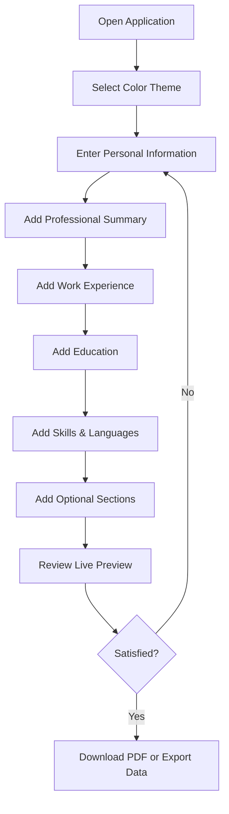
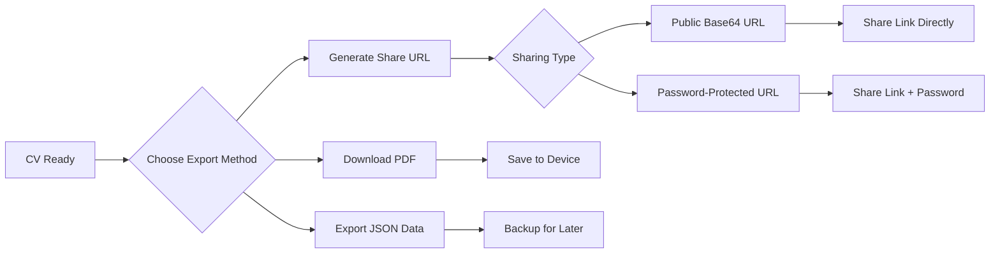
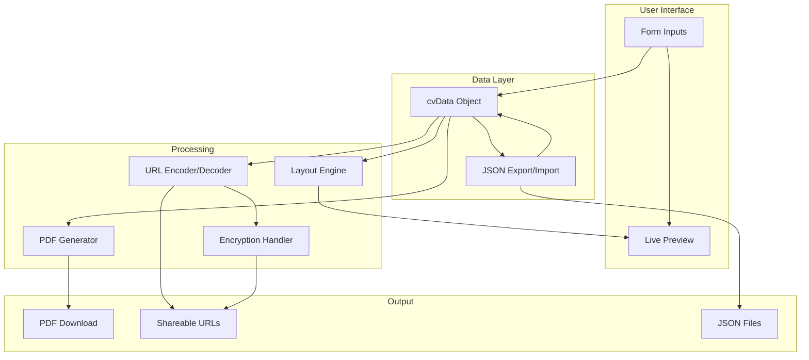

# xsukax CV Maker

A powerful, privacy-focused web application for creating professional CVs and resumes entirely in your browser. No server-side processing, no data collection, and complete control over your personal information.

**Demo:** [https://xsukax.github.io/xsukax-CV-Maker](https://xsukax.github.io/xsukax-CV-Maker)

[CV Example](https://xsukax.github.io/xsukax-CV-Maker/?cv=JTdCJTIyY29sb3IlMjIlM0ElMjIlMjMwOTY5ZGElMjIlMkMlMjJudW1iZXJQYWdlcyUyMiUzQXRydWUlMkMlMjJwZXJzb25hbEluZm8lMjIlM0ElN0IlMjJmdWxsTmFtZSUyMiUzQSUyMkhhcm9sZCUyMFIlMjBCbGFudG9uJTIyJTJDJTIydGl0bGUlMjIlM0ElMjJFbmdpbmVlciUyMiUyQyUyMmVtYWlsJTIyJTNBJTIyZ2VqaWhpeDUwOCU0MGV4YW1wbGUuY29tJTIyJTJDJTIycGhvbmUlMjIlM0ElMjIlMkIxOTE2MjU3NTI1NCUyMiUyQyUyMmFkZHJlc3MlMjIlM0ElMjIlMjBSb3NldmlsbGUlMkMlMjBDYWxpZm9ybmlhKENBKSUyQ1VTJTIyJTdEJTJDJTIyc3VtbWFyeSUyMiUzQSUyMkN1c3RvbWVyLWZvY3VzZWQlMjBwcm9mZXNzaW9uYWwlMjB3aXRoJTIwYSUyMHN0cm9uZyUyMGJhY2tncm91bmQlMjBpbiUyMHNhbGVzJTJDJTIwY2xpZW50JTIwc3VwcG9ydCUyQyUyMGFuZCUyMHJlbGF0aW9uc2hpcCUyMG1hbmFnZW1lbnQuJTIwUmVjb2duaXplZCUyMGZvciUyMGV4Y2VwdGlvbmFsJTIwY29tbXVuaWNhdGlvbiUyMHNraWxscyUyQyUyMHByb2JsZW0lMjByZXNvbHV0aW9uJTJDJTIwYW5kJTIwdGhlJTIwYWJpbGl0eSUyMHRvJTIwdW5kZXJzdGFuZCUyMGN1c3RvbWVyJTIwbmVlZHMlMjB0byUyMGRyaXZlJTIwc2F0aXNmYWN0aW9uJTIwYW5kJTIwbG95YWx0eS4lMjBUcmFjayUyMHJlY29yZCUyMG9mJTIwc3VycGFzc2luZyUyMHNhbGVzJTIwdGFyZ2V0cyUyMGFuZCUyMGltcHJvdmluZyUyMGN1c3RvbWVyJTIwZXhwZXJpZW5jZS4lMjBTZWVraW5nJTIwdG8lMjBicmluZyUyMHZhbHVlJTJDJTIwcHJvZmVzc2lvbmFsaXNtJTJDJTIwYW5kJTIwYWRhcHRhYmlsaXR5JTIwdG8lMjBhJTIwZHluYW1pYyUyMG9yZ2FuaXphdGlvbi4lMjIlMkMlMjJza2lsbHMlMjIlM0ElMjJKUyUyQyUyMEFtYXpvbiUyMiUyQyUyMmxhbmd1YWdlcyUyMiUzQSUyMkVuZ2xpc2glMkMlMjBGcmVuY2glMjIlMkMlMjJyZWZlcmVuY2VzJTIyJTNBJTIyQkJDJTJDJTIwQ05OJTIyJTJDJTIyZXhwZXJpZW5jZXMlMjIlM0ElNUIlN0IlMjJpZCUyMiUzQTAlMkMlMjJ0aXRsZSUyMiUzQSUyMlNlbmlvciUyMFBIUCUyMFByb2dyYW1tZXIlMjIlMkMlMjJjb21wYW55JTIyJTNBJTIyUEhQJTIyJTJDJTIyc3RhcnREYXRlJTIyJTNBJTIySmFuJTIwMjAyMCUyMiUyQyUyMmVuZERhdGUlMjIlM0ElMjJKYW4lMjAyMDIxJTIyJTJDJTIyZGVzY3JpcHRpb24lMjIlM0ElMjJJJTIwY2FuJTIwd3JpdGUlMjBhbGwlMjBwaHAlMjBjb2RlJTIwYXBwbGljYXRpb25zJTIwZWFzaWx5LiUyMiU3RCUyQyU3QiUyMmlkJTIyJTNBMSUyQyUyMnRpdGxlJTIyJTNBJTIyU2VuaW9yJTIwSlMlMjBQcm9ncmFtbWVyJTIyJTJDJTIyY29tcGFueSUyMiUzQSUyMkFtYXpvbiUyMiUyQyUyMnN0YXJ0RGF0ZSUyMiUzQSUyMkZlYiUyMDIwMjElMjIlMkMlMjJlbmREYXRlJTIyJTNBJTIyRmViJTIwMjAyMiUyMiUyQyUyMmRlc2NyaXB0aW9uJTIyJTNBJTIySSUyMGNhbiUyMHdyaXRlJTIwYWxsJTIwanMlMjBjb2RlJTIwYXBwbGljYXRpb25zJTIwZWFzaWx5LiUyMiU3RCU1RCUyQyUyMmVkdWNhdGlvbiUyMiUzQSU1QiU3QiUyMmlkJTIyJTNBMCUyQyUyMmRlZ3JlZSUyMiUzQSUyMkJhY2hlbG9yJTIyJTJDJTIyaW5zdGl0dXRpb24lMjIlM0ElMjJVU0ElMjBVbml2ZXJzaXR5JTIyJTJDJTIyeWVhciUyMiUzQSUyMjIwMjAlMjIlMkMlMjJncmFkZSUyMiUzQSUyMjMuNSUyMiU3RCU1RCUyQyUyMmNlcnRpZmljYXRpb25zJTIyJTNBJTVCJTdCJTIyaWQlMjIlM0EwJTJDJTIybmFtZSUyMiUzQSUyMlBIUCUyMFNlbmlvciUyMiUyQyUyMmlzc3VlciUyMiUzQSUyMlBIUCUyMiUyQyUyMmRhdGUlMjIlM0ElMjJKYW4lMjAyMDE5JTIyJTdEJTVEJTJDJTIycHJvamVjdHMlMjIlM0ElNUIlN0IlMjJpZCUyMiUzQTAlMkMlMjJuYW1lJTIyJTNBJTIyRmFjZWJvb2slMjIlMkMlMjJkZXNjcmlwdGlvbiUyMiUzQSUyMkklMjB3cml0ZSUyMEZhY2Vib29rJTIwQ29kZSUyMiUyQyUyMnRlY2hub2xvZ2llcyUyMiUzQSUyMkhUTUwlMkMlMjBKUyUyQyUyMFBIUCUyQyUyMENTUyUyMiU3RCU1RCUyQyUyMmF3YXJkcyUyMiUzQSU1QiU3QiUyMmlkJTIyJTNBMCUyQyUyMnRpdGxlJTIyJTNBJTIyTm9ibGUlMjBQcml6ZSUyMiUyQyUyMmlzc3VlciUyMiUzQSUyMk5vYmxlJTIyJTJDJTIyZGF0ZSUyMiUzQSUyMkZlYiUyMDIwMjMlMjIlN0QlNUQlN0Q=)

## Project Overview

xsukax CV Maker is a modern, single-page application that empowers users to create, customize, and export professional CVs without compromising privacy. Built with vanilla JavaScript and leveraging client-side technologies, the application processes all data locally in the browser, ensuring that sensitive personal information never leaves your device. The tool features a live preview system, multiple export options, and comprehensive customization capabilities to meet diverse professional needs.

## Security and Privacy Benefits

### Complete Client-Side Processing
All data processing occurs exclusively within your browser. No information is transmitted to external servers, eliminating risks associated with data breaches, unauthorized access, or third-party data mining.

### No Server Dependencies
The application runs entirely as a static HTML file, requiring no backend infrastructure. This architecture ensures there are no server logs, databases, or storage systems that could potentially expose your personal information.

### Local Data Storage
CV data can be exported and imported as JSON files, giving you complete ownership and control over your information. You decide where to store your data and who has access to it.

### Encrypted Sharing Option
When sharing CVs via URL, the application offers password-protected encryption using AES encryption (CryptoJS). This ensures that shared CVs remain confidential and accessible only to intended recipients with the correct password.

### No Tracking or Analytics
The application contains no tracking scripts, analytics tools, or cookies that monitor user behavior. Your privacy is respected at every interaction.

### Secure Photo Handling
Uploaded photos are processed and compressed locally in the browser using HTML5 Canvas API. Images are converted to base64 format and stored within the application session without external uploads.

## Features and Advantages

### Comprehensive CV Sections
- **Personal Information**: Name, title, contact details, and professional photo
- **Professional Summary**: Highlight your career objectives and key qualifications
- **Work Experience**: Detailed employment history with dates and descriptions
- **Education**: Academic credentials with institutions and achievements
- **Skills**: Technical and soft skills with customizable formatting
- **Languages**: Multilingual proficiency levels
- **Certifications**: Professional certifications and credentials
- **Projects**: Portfolio projects with technologies and descriptions
- **Awards**: Recognition and achievements
- **References**: Professional references section

### Advanced Customization
- **Color Themes**: 8 preset color schemes plus custom color picker for personalized branding
- **Page Numbering**: Optional page numbering starting from page 2
- **Live Preview**: Real-time rendering of CV as you type
- **Responsive Layout**: Automatic pagination and content flow across multiple pages
- **Professional Typography**: Clean, readable fonts optimized for print and digital formats

### Multiple Export Options
- **PDF Generation**: High-quality PDF export using jsPDF and html2canvas libraries
- **JSON Export**: Save CV data for backup, version control, or future editing
- **Shareable URLs**: Generate base64-encoded URLs for easy sharing
- **Encrypted URLs**: Password-protected sharing for sensitive information

### User Experience Excellence
- **Intuitive Interface**: GitHub-inspired design with clear visual hierarchy
- **Dynamic Sections**: Add or remove multiple entries for experiences, education, and more
- **Auto-save Data**: Import previously saved CV data to continue editing
- **Mobile Responsive**: Scales appropriately for different screen sizes
- **Instant Notifications**: User-friendly feedback for all actions

### Zero Dependencies on External Services
- All libraries loaded from reliable CDNs (Tailwind CSS, jsPDF, html2canvas, CryptoJS)
- Works offline after initial page load (with cached resources)
- No registration, login, or account creation required

## Installation Instructions

### Prerequisites
- A modern web browser (Chrome, Firefox, Safari, Edge - latest versions recommended)
- Internet connection for initial page load (to fetch CDN libraries)

### Local Installation

1. **Clone the Repository**
   ```bash
   git clone https://github.com/xsukax/xsukax-CV-Maker.git
   cd xsukax-CV-Maker
   ```

2. **Open the Application**
   - Simply open `index.html` in your web browser
   - No build process or compilation required
   
   ```bash
   # Using your default browser
   open index.html
   
   # Or using a specific browser
   firefox index.html
   chrome index.html
   ```

### Docker Deployment (Optional)

Create a simple `Dockerfile` for containerized deployment:

```dockerfile
FROM nginx:alpine
COPY index.html /usr/share/nginx/html/
EXPOSE 80
CMD ["nginx", "-g", "daemon off;"]
```

Build and run:
```bash
docker build -t cv-maker .
docker run -d -p 8080:80 cv-maker
```

## Usage Guide

### Creating Your First CV



### Step-by-Step Workflow

#### 1. Customize Appearance
- **Select a color theme** by clicking on one of the preset color options or using the custom color picker
- **Toggle page numbering** using the checkbox (numbers appear from page 2 onwards)

#### 2. Fill in Personal Information
- Enter your full name (required)
- Add professional title
- Provide contact details (email, phone, address)
- Upload a professional photo (optional - automatically compressed)

#### 3. Add Content Sections

**Work Experience:**
- Click "+ Add Experience" button
- Fill in job title, company name, dates, and description
- Add multiple positions as needed
- Remove entries using the "Remove" button

**Education:**
- Click "+ Add Education"
- Enter degree, institution, year, and GPA/grade
- Add multiple educational qualifications

**Additional Sections:**
- Skills: Enter comma-separated list (automatically formatted with bullets)
- Languages: List language proficiencies
- Certifications: Add professional credentials
- Projects: Showcase portfolio work
- Awards: Highlight achievements
- References: Add reference statement

#### 4. Export and Share



**Download PDF:**
- Click "Download PDF" button in the header
- High-quality PDF generated automatically
- File named based on your full name

**Export Data:**
- Click "Export" to download JSON file
- Save for backup or version control
- Contains all CV information and settings

**Import Data:**
- Click "Import" to load previously saved JSON file
- All fields automatically populated
- Continue editing from where you left off

**Share CV:**
- Click "Share" button
- Choose sharing method:
  - **Base64 URL**: Publicly accessible link (no password)
  - **Encrypted URL**: Password-protected link for sensitive data
- Copy generated URL and share with recipients

#### 5. Load Shared CV

When someone shares a CV URL with you:

1. **Public URL**: Open the link directly - CV loads automatically
2. **Encrypted URL**: 
   - Open the link
   - Enter password when prompted
   - CV decrypts and displays

### Application Architecture



### Keyboard Shortcuts and Tips

- **Auto-save workflow**: Export JSON regularly to prevent data loss
- **Multiple CVs**: Export different versions for different job applications
- **Preview scaling**: The preview automatically scales on smaller screens
- **Print-ready**: Generated PDFs are optimized for printing on A4 paper
- **Browser compatibility**: Works best on Chrome, Firefox, Safari, and Edge (latest versions)

## Licensing Information

This project is licensed under the GNU General Public License v3.0.

---

## Contributing

Contributions are welcome! Please feel free to submit issues or pull requests to improve the application.

## Support

For questions, issues, or feature requests, please open an issue on the [GitHub repository](https://github.com/xsukax/xsukax-CV-Maker/issues).

## Acknowledgments

- Built with vanilla JavaScript for maximum compatibility
- Uses Tailwind CSS for responsive styling
- PDF generation powered by jsPDF and html2canvas
- Encryption provided by CryptoJS

---

**Made with privacy and security in mind. Your data never leaves your browser.**
